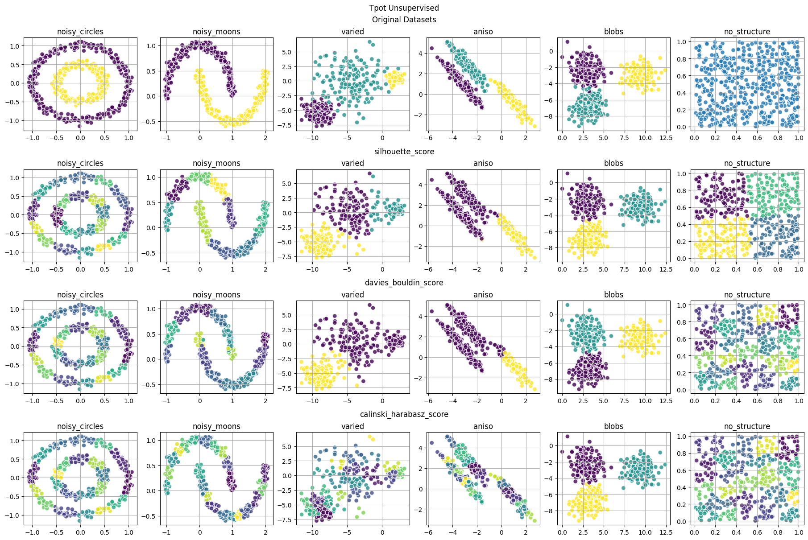

Master status: [](https://travis-ci.com/EpistasisLab/tpot)
[](https://ci.appveyor.com/project/weixuanfu/tpot?branch=master)
[](https://coveralls.io/github/EpistasisLab/tpot?branch=master)

Development status: [](https://travis-ci.com/EpistasisLab/tpot/branches)
[](https://ci.appveyor.com/project/weixuanfu/tpot?branch=development)
[](https://coveralls.io/github/EpistasisLab/tpot?branch=development)

Package information: [](https://www.python.org/downloads/release/python-370/)
[](http://www.gnu.org/licenses/lgpl-3.0)
[](https://badge.fury.io/py/TPOT)

<p align="center">

</p>

---
Welcome to the new fork of the [TPOT](https://github.com/EpistasisLab/tpot) framework, now to support clustering! This extension enables TPOT to automatically optimize clustering algorithms by maximizing key evaluation metrics such as the [Silhouette score](https://en.wikipedia.org/wiki/Silhouette_(clustering)), [Davies–Bouldin index](https://en.wikipedia.org/wiki/Davies–Bouldin_index), and [Calinski–Harabasz index](https://en.wikipedia.org/wiki/Calinski-Harabasz_index). With this addition, TPOT can now automatically discover the optimal clustering pipelines, making it a powerful tool for unsupervised learning tasks. Whether you're dealing with customer segmentation, anomaly detection, or any other clustering problem, this forked version of TPOT streamlines the process, ensuring you achieve the best possible clustering performance with minimal manual intervention.
- - - -

**TPOT** stands for **T**ree-based **P**ipeline **O**ptimization **T**ool, now for **clustering**. TPOT-clustering is a Python Automated Unsupervised Machine Learning tool that optimizes machine learning pipelines using genetic programming.

TPOT-clustering will automate the most tedious part of unsupervised machine learning by exploring thousands of possible pipelines to find the best one, optimizing clustering metrics for your data.

## An example of clustering pipeline

Once TPOT-clustering finishes optimizing, it provides you with the Python code for the best pipeline it found, so you can tinker with the pipeline from there. TPOT-clustering is built on top of [TPOT](https://github.com/EpistasisLab/tpot) and scikit-learn, so all of the code it generates should look familiar if you’re already comfortable with scikit-learn.

## License

TPOT-Clustering is a fork of [TPOT](https://github.com/EpistasisLab/tpot), and as such, follows the same licensing and usage terms.  
For details, please refer to the [repository license](https://github.com/EpistasisLab/tpot/blob/master/LICENSE).

Generally, TPOT is licensed to be as widely usable as possible.

## Installation

You can install TPOT-Clustering directly from the repository using pip. Make sure you have [pip](https://pip.pypa.io/en/stable/) installed.

```bash
pip install git+https://github.com/Mcamilo/tpot-clustering.git
```
Alternatively, if you have cloned the repository, you can install it using the setup.py file:
```bash
git clone https://github.com/Mcamilo/tpot-clustering.git
cd tpot-clustering
pip install .
```

## Examples of Usage (Clustering)

Now, TPOT can optimize solutions for unsupervised clustering problems using the evaluation metrics provided by scikit-learn to synthesize optimal pipelines, namely `silhouette_score`, `davies_bouldin_score`, and `calinski_harabasz_score`. Below is a minimal working example with the sklearn's breast cancer dataset.

```python 
import pandas as pd
from tpot import TPOTClustering
from sklearn.datasets import load_breast_cancer

data = load_breast_cancer().data
scoring = "silhouette_score"

tpot_clustering = TPOTClustering(generations=5, population_size=50, verbosity=2, random_state=42, scoring=scoring)
tpot_clustering.fit(data)
print(tpot_clustering.score(data))
tpot_clustering.export(f"tpot_clustering_{scoring}.py")
```
The **generated code** in `tpot_clustering_silhouette_score.py` includes the optimized pipeline, along with a PCA component to visualize the partitionings of the dataset:

```python
import numpy as np
import pandas as pd
from sklearn.cluster import KMeans
import matplotlib.pyplot as plt
from sklearn.preprocessing import StandardScaler
from sklearn.decomposition import PCA


# NOTE: Make sure that the csv file with the doesn't contain targets
training_features = pd.read_csv('PATH/TO/DATA/FILE', dtype=np.float64)
# Average CV score on the training set was: 0.7072801240568758

# Standardize the data
scaler = StandardScaler()
scaled_data = scaler.fit_transform(training_features)

# Perform PCA
pca = PCA(n_components=2)
pca_data = pca.fit_transform(scaled_data)
        
exported_pipeline = KMeans(init="random", n_clusters=2)
clusters = exported_pipeline.fit_predict(pca_data)

# Plot PCA
plt.figure(figsize=(10, 7))
plt.scatter(pca_data[:, 0], pca_data[:, 1], c=clusters, cmap='viridis', marker='o', edgecolor='k', s=100)
if hasattr(exported_pipeline,"cluster_centers_"):
    centroids = exported_pipeline.cluster_centers_
    plt.scatter(centroids[:, 0], centroids[:, 1], c='red', marker='X', s=200, alpha=0.75)
plt.title('PCA of the Dataset with the exported clustering pipeline')
plt.xlabel('Principal Component 1')
plt.ylabel('Principal Component 2')
plt.grid(True)

# Save the PCA plot
plt.savefig('pca_plot.png')

print("PCA plot saved as 'pca_plot.png'.")

```

Optimizing a clustering pipeline for different metrics such as the Silhouette score or the Davies-Bouldin score can lead to variations in the resulting clusters due to the distinct ways these metrics evaluate clustering quality, make sure you select a metric that better suit your needs:



## Contributing to TPOT-Clustering

We welcome you to [check the existing issues](https://github.com/Mcamilo/tpot-clustering/issues) for bugs or enhancements to work on. If you have an idea for an extension to TPOT-Clustering, please [file a new issue](https://github.com/Mcamilo/tpot/issues/new) so we can discuss it.

## Citing TPOT-Clustering

TPOT-Clustering was developed as part of a PhD project in the ADSAI PhD program at the University of Trieste, by [Matheus Camilo da Silva](https://www.linkedin.com/in/matheus-camilo-da-silva/) under the supervision of [Sylvio Barbon Junior](https://www.linkedin.com/in/barbon/).

For the clustering extension, please cite:

You can cite TPOT-Clustering using the paper accepted at [IJCNN 2025](https://2025.ijcnn.org/).

```latex
@inproceedings{Camilo2025,
  title={TPOT-Clustering},
  author={Matheus Camilo da Silva and Sylvio Barbon Junior},
  booktitle={2025 International Joint Conference on Neural Networks (IJCNN)},
  year={2025},
  organization={IEEE}
}
```

If you use TPOT for classification or regression in your research, please consider citing the original TPOT paper:

```latex
@inproceedings{Olson2016,
  title={TPOT: A Tree-Based Pipeline Optimization Tool for Automating Machine Learning},
  author={Randal S. Olson and others},
  booktitle={Automated Machine Learning},
  year={2016},
  pages={66-74},
  publisher={Springer}
}
```


## Support for TPOT

TPOT-Clustering was developed in the [Machine Learning Lab](https://machinelearning.inginf.units.it/) at the [University of Trieste](https://www.units.it).

The TPOT-Clustering logo is an adaptation of the original TPOT logo, which was designed by Todd Newmuis for the TPOT project.
